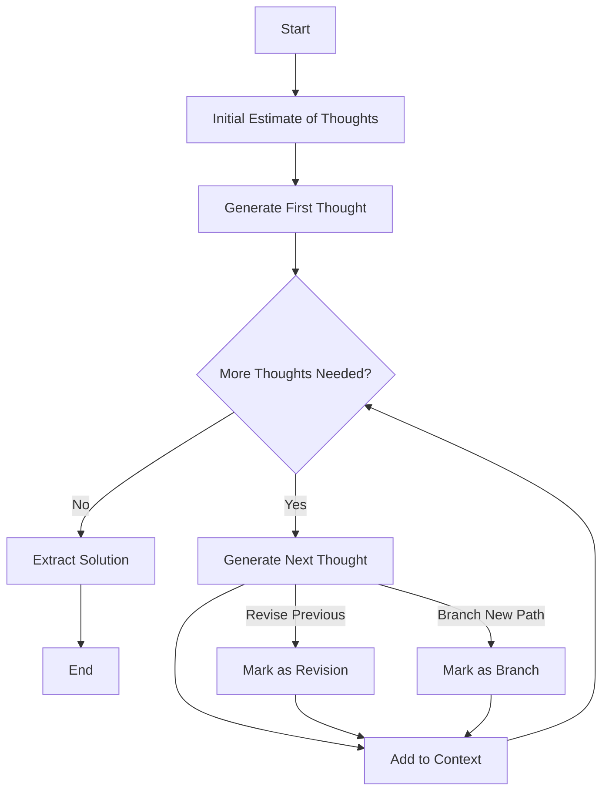

[](https://mseep.ai/app/sethdford-vibe-coder-mcp)

# Vibe Coder MCP Server

Vibe Coder is an MCP (Model Context Protocol) server designed to supercharge your AI assistant (like Cursor, Cline AI, or Claude Desktop) with powerful tools for software development. It helps with research, planning, generating requirements, creating starter projects, and more!

## Overview & Features

Vibe Coder MCP integrates with MCP-compatible clients to provide the following capabilities:

*   **Sequential Thinking**: Processes problems through a flexible, step-by-step thinking approach.
*   **Request Processor**: Routes and manages requests to appropriate specialized tools.
*   **Research Manager**: Performs deep research using Perplexity Sonar.
*   **Rules Generator**: Creates development rules tailored to specific projects.
*   **PRD Generator**: Produces detailed product requirements documents.
*   **User Stories Generator**: Creates structured user stories with acceptance criteria.
*   **Task List Generator**: Develops detailed development task lists with dependencies.
*   **Fullstack Starter Kit Generator**: Creates custom project starter kits with tailored tech stacks.

*(See "Detailed Tool Documentation" and "Feature Details" sections below for more)*

## Setup Guide

Follow these steps to get the Vibe Coder MCP server running and connected to your AI assistant.

### Step 1: Prerequisites

Make sure you have the following installed on your system:

1.  **Node.js:** Version 18 or higher recommended. (This includes `npm`, the Node Package Manager). You can download it from [nodejs.org](https://nodejs.org/).
2.  **Git:** For cloning the repository. You can download it from [git-scm.com](https://git-scm.com/).
3.  **OpenRouter API Key:** Vibe Coder uses models via OpenRouter. Get a free key at [openrouter.ai](https://openrouter.ai/).

### Step 2: Get the Code

Open your terminal or command prompt and clone this repository:

```bash
git clone https://github.com/freshtechbro/vibe-coder-mcp.git # Or your fork's URL
```

Navigate into the newly cloned directory:

```bash
cd vibe-coder-mcp
```

### Step 3: Run the Setup Script

This script installs dependencies, builds the project, and prepares necessary files.

*   **On Windows:**
    ```batch
    setup.bat
    ```

*   **On macOS or Linux:**
    ```bash
    chmod +x setup.sh
    ./setup.sh
    ```

The script will tell you if it creates a `.env` file.

### Step 4: Add Your API Key

1.  Open the `.env` file located in the `vibe-coder-mcp` directory with a text editor.
2.  Find the line `OPENROUTER_API_KEY=your_openrouter_api_key_here`.
3.  Replace `your_openrouter_api_key_here` with your actual OpenRouter API key.
4.  Save and close the `.env` file.

### Step 5: Integrate with Your AI Assistant

This is the crucial step to connect Vibe Coder to your AI tool. You need to edit the specific configuration file for your assistant.

**A. Find Your Project's Absolute Path:**

You'll need the full path to the `build/index.js` file within the `vibe-coder-mcp` directory you cloned.

*   **Easy way:** Navigate into the `vibe-coder-mcp/build` directory in your terminal and run:
    *   Windows: `cd build` then `echo %cd%\index.js` (Copy the output)
    *   macOS/Linux: `cd build` then `pwd` (Copy the output and append `/index.js`)
*   **Example:** `C:/Users/YourName/Projects/vibe-coder-mcp/build/index.js` or `/Users/YourName/Projects/vibe-coder-mcp/build/index.js`

**B. Prepare the Configuration Block:**

Copy the following JSON block and **replace `<ABSOLUTE_PATH_TO_BUILD_INDEX_JS>`** with the actual path you found above. Also, **replace `<YOUR_OPENROUTER_API_KEY>`** with your key.

```json
    "vibe-coder-mcp": {
      "command": "node",
      "args": ["<ABSOLUTE_PATH_TO_BUILD_INDEX_JS>"],
      "env": {
        "NODE_ENV": "production",
        "OPENROUTER_API_KEY": "<YOUR_OPENROUTER_API_KEY>",
        "OPENROUTER_BASE_URL": "https://openrouter.ai/api/v1",
        "GEMINI_MODEL": "google/gemini-2.0-flash-001",
        "PERPLEXITY_MODEL": "perplexity/sonar-deep-research"
      },
      "disabled": false,
      "autoApprove": [
        "research", 
        "generate-rules", 
        "generate-prd", 
        "generate-user-stories", 
        "generate-task-list", 
        "generate-fullstack-starter-kit", 
        "process-request"
      ] 
    }
```

**C. Edit Your Assistant's Configuration File:**

*   **Cursor / Windsurf (using VS Code `settings.json`):**
    1.  Open Cursor/Windsurf.
    2.  Open the Command Palette (`Ctrl+Shift+P` or `Cmd+Shift+P`).
    3.  Search for and select `Preferences: Open User Settings (JSON)`.
    4.  Find the `"mcpServers": { ... }` object. If it doesn't exist, add it like this: `"mcpServers": {}`.
    5.  Paste the prepared configuration block (from step B) inside the curly braces `{}` of `mcpServers`. If other servers are already listed, add a comma `,` before pasting.
    6.  Save the `settings.json` file.

*   **Cline AI (VS Code Extension):**
    1.  Open VS Code.
    2.  Locate the settings file, typically at:
        *   Windows: `C:\Users\[YourUsername]\AppData\Roaming\Cursor\User\globalStorage\saoudrizwan.claude-dev\settings\cline_mcp_settings.json`
        *   macOS: `~/Library/Application Support/Cursor/User/globalStorage/saoudrizwan.claude-dev/settings/cline_mcp_settings.json` (Path might vary slightly)
        *   Linux: `~/.config/Cursor/User/globalStorage/saoudrizwan.claude-dev/settings/cline_mcp_settings.json`
    3.  Open this `cline_mcp_settings.json` file.
    4.  Find the `"mcpServers": { ... }` object. If it doesn't exist, add it.
    5.  Paste the prepared configuration block (from step B) inside the `mcpServers` object (adding a comma if needed).
    6.  Save the file.

*   **Claude Desktop:**
    1.  Locate the settings file:
        *   Windows: `C:\Users\[YourUsername]\AppData\Roaming\Claude\claude_desktop_config.json`
        *   macOS: `~/Library/Application Support/Claude/claude_desktop_config.json`
    2.  Open this `claude_desktop_config.json` file.
    3.  Find the `"mcpServers": { ... }` object. If it doesn't exist, add it.
    4.  Paste the prepared configuration block (from step B) inside the `mcpServers` object (adding a comma if needed).
    5.  Save the file.

**Important Notes for Configuration:**
*   **Absolute Path is Crucial:** Make sure the path in `"args"` is the full, absolute path to `build/index.js`. Relative paths usually won't work.
*   **Use Forward Slashes:** Even on Windows, use forward slashes `/` in the path within the JSON file (e.g., `C:/Users/...`).
*   **`NODE_ENV`:** Keep `"NODE_ENV": "production"` in the `env` block. This ensures logging works correctly without interfering with the AI assistant.

### Step 6: Restart Your AI Assistant

**Completely close and reopen** Cursor, VS Code (with Cline AI), or Claude Desktop. This allows it to load the new MCP server configuration.

That's it! Your Vibe Coder MCP server should now be connected and ready to use within your AI assistant.

## Project Structure

```
vibe-coder-mcp/
├── .env                  # Environment configuration (for local runs)
├── mcp-config.json       # Example MCP configuration snippet
├── package.json          # Project dependencies
├── README.md             # This file
├── setup.bat             # Windows setup script
├── setup.sh              # macOS/Linux setup script
├── tsconfig.json         # TypeScript configuration
├── build/                # Compiled JavaScript output (created by npm run build)
└── src/                  # Source code
    ├── index.ts          # Entry point
    ├── logger.ts         # Logging configuration
    ├── server.ts         # MCP server setup
    ├── services/         # Support services (request processing, matching)
    │   ├── hybrid-matcher/
    │   ├── intent-service/
    │   ├── matching-service/
    │   └── request-processor/
    ├── tools/            # Tool implementations
    │   ├── fullstack-starter-kit-generator/
    │   │   └── README.md # Detailed tool documentation
    │   ├── prd-generator/
    │   │   └── README.md # Detailed tool documentation
    │   ├── research-manager/
    │   │   └── README.md # Detailed tool documentation
    │   ├── rules-generator/
    │   │   └── README.md # Detailed tool documentation
    │   ├── sequential-thinking.ts
    │   ├── task-list-generator/
    │   │   └── README.md # Detailed tool documentation
    │   └── user-stories-generator/
    │       └── README.md # Detailed tool documentation
    ├── utils/            # Shared utility functions
    │   └── researchHelper.ts # Centralized Perplexity research functionality
    └── types/            # TypeScript type definitions
        ├── globals.d.ts
        ├── tools.ts
        └── workflow.ts
```

## Detailed Tool Documentation

Each tool in the `src/tools/` directory includes comprehensive documentation in its own README.md file (where available). These files cover:

*   Tool overview and purpose
*   Input/output specifications
*   Workflow diagrams (Mermaid)
*   Usage examples
*   System prompts used
*   Error handling details

Refer to these individual READMEs for in-depth information:

*   `src/tools/fullstack-starter-kit-generator/README.md`
*   `src/tools/prd-generator/README.md`
*   `src/tools/research-manager/README.md`
*   `src/tools/rules-generator/README.md`
*   `src/tools/task-list-generator/README.md`
*   `src/tools/user-stories-generator/README.md`
*   *(Sequential Thinking tool details are primarily in `src/tools/sequential-thinking.ts`)*

## Feature Details

### Sequential Thinking Tool (`sequential-thinking.ts`)

Implements a dynamic problem-solving approach:

*   **Dynamic Problem Analysis**: Breaks down complex problems into sequential thoughts.
*   **Adaptive Processing**: Adjusts the number of thinking steps based on complexity.
*   **Revision Capability**: Can question, revise, or branch from previous thoughts.
*   **Solution Verification**: Verifies hypotheses based on the chain of thought.
*   Leverages LLMs via OpenRouter for cognitive processing.

### Request Processor (`src/services/request-processor/`)

The orchestration layer that:

*   Handles routing of requests to appropriate specialized tools.
*   Validates inputs across all tools.
*   Processes tool-specific parameters.
*   Manages request/response handling for the MCP protocol.

### Generator Tools (`src/tools/*-generator/`)

These tools follow a similar pattern:
1.  Validate input.
2.  Perform pre-generation research using Perplexity (`researchHelper.ts`).
3.  Assemble a prompt including inputs and research context.
4.  Generate the primary output (PRD, rules, etc.) using Gemini via `processWithSequentialThinking`.
5.  Format and save the output artifact.
6.  Return the result via MCP.

*   **Research Manager (`research`):** Performs research as its primary function, enhanced by Gemini.
*   **Rules Generator (`generate-rules`):** Creates project-specific development rules.
*   **PRD Generator (`generate-prd`):** Generates comprehensive product requirements documents.
*   **User Stories Generator (`generate-user-stories`):** Creates detailed user stories with acceptance criteria.
*   **Task List Generator (`generate-task-list`):** Builds structured development task lists with dependencies.
*   **Fullstack Starter Kit Generator (`generate-fullstack-starter-kit`):** Creates customized project starter kits (definition JSON and setup scripts).

## System Flow

```mermaid
flowchart TD
    User[User] -->|Request| Server[MCP Server]
    
    Server -->|Process Request| RP[Request Processor]
    
    RP -->|May use Sequential Thinking| ST[Sequential Thinking]
    ST -->|Returns Analysis/Result| RP
    
    RP -->|Route to Tool| SpecificTool{Specific Tool}
    
    SpecificTool -- Pre-Generation Research --> ResearchUtil[researchHelper.ts (Perplexity)]
    ResearchUtil -->|Research Context| SpecificTool
    
    SpecificTool -- Generation --> SeqThinkingUtil[processWithSequentialThinking (Gemini)]
    SeqThinkingUtil -->|Generated Content| SpecificTool
    
    SpecificTool -->|Save Artifact| FileSystem[workflow-agent-files]
    SpecificTool -->|Tool Results| Server
    
    Server -->|Response| User
```

## Sequential Thinking Process



## Generated File Storage

Outputs from the generator tools (PRDs, rules, research reports, etc.) are stored for historical reference in the `workflow-agent-files` directory, organized into subdirectories by tool name:

```bash
workflow-agent-files/
  ├── research-manager/
  ├── rules-generator/
  ├── prd-generator/
  ├── user-stories-generator/
  ├── task-list-generator/
  └── fullstack-starter-kit-generator/ 
```
Files are time-stamped (e.g., `[timestamp]-[sanitized-name]-prd.md`).

## Usage Examples

Interact with the tools via your connected AI assistant:

*   **Research:** `Research modern JavaScript frameworks`
*   **Generate Rules:** `Create development rules for a mobile banking application`
*   **Generate PRD:** `Generate a PRD for a task management application`
*   **Generate User Stories:** `Generate user stories for an e-commerce website`
*   **Generate Task List:** `Create a task list for a weather app based on [user stories]`
*   **Sequential Thinking:** `Think through the architecture for a microservices-based e-commerce platform`
*   **Fullstack Starter Kit:** `Create a starter kit for a React/Node.js blog application with user authentication`

## Running Locally (Optional)

While the primary use is integration with an AI assistant (using stdio), you can run the server directly for testing:

*   **Production Mode (Stdio):** `npm start` (Logs go to stderr, mimics AI assistant launch)
*   **Development Mode (Stdio, Pretty Logs):** `npm run dev` (Logs go to stdout, requires `nodemon`, `pino-pretty`)
*   **SSE Mode (HTTP Interface):** `npm run start:sse` or `npm run dev:sse` (Uses HTTP, configured via `PORT` in `.env`)

## Troubleshooting

*   **Connection Errors in AI Assistant:**
    *   Did you completely restart the AI assistant after editing its configuration file?
    *   Is the absolute path in the configuration's `"args"` correct and using forward slashes `/`?
    *   Is `"disabled": false` set for `vibe-coder-mcp` in the config?
*   **API Key Errors:**
    *   Is the `OPENROUTER_API_KEY` correct in the AI assistant's configuration `env` block?
    *   (For local runs) Is the key correct in the `.env` file?
    *   Does your OpenRouter account have credits?
*   **JSON Errors on Startup (in AI Assistant):**
    *   Ensure `"NODE_ENV": "production"` is set in the AI assistant's configuration `env` block for `vibe-coder-mcp`. This is critical for correct logging.
*   **File Permission Issues (during setup or tool use):**
    *   Ensure your user has write permissions in the `vibe-coder-mcp` directory and its subdirectories (especially `workflow-agent-files`).

## License

MIT
